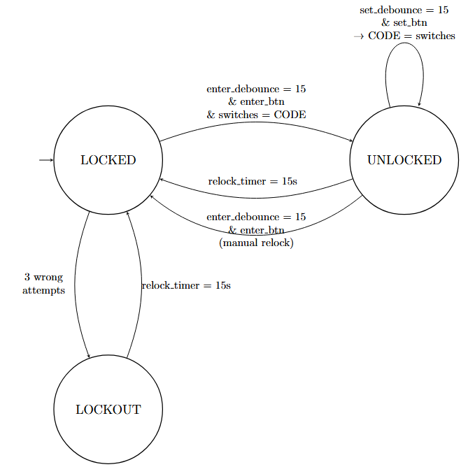
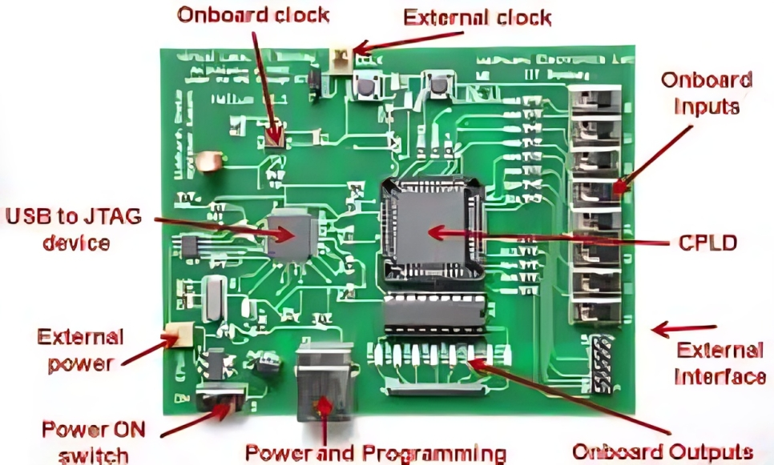

# 🔐 Verilog-Digital-Lock-System

A **password-based digital lock** system implemented using **Verilog HDL** and deployed on a **CPLD board**. The design includes a lock/unlock mechanism, password reset functionality, auto-relock, lockout after multiple incorrect attempts, and LED status indicators.

---

## 🎯 Project Highlights

- ✔️ 4-bit switch-based password input
- 🔄 Password reset in unlocked state
- ❌ Lockout after 3 failed attempts
- ⏱️ Auto-relock after timeout (15 seconds)
- 🔇 Debounced buttons for accurate input
- 💡 LED indicators for locked, unlocked, lockout, and ready-to-set states

---

## 📁 Project Structure

```
CPLD-Password-Lock-With-Reset/
├── docs/
│   ├── REPORT.pdf                  # Detailed project report
|   ├── Manual.pdf                  # Detail of CPLD board used
│   └── state_diagram.png           # FSM diagram
├── media/
│   └── setup.png                   # Image of CPLD hardware setup
├── src/
│   └── digital_lock.v              # Verilog HDL for the system
└── README.md
```

---

## 💡 System Description

### 🔌 Inputs
- `switches[3:0]`: 4-bit password input
- `enter_btn`: Confirms entry or relocks system
- `set_btn`: Sets new password in unlocked state
- `clk`: 1 Hz system clock

### 💡 Outputs
- `leds[0]`: Locked (Red)
- `leds[1]`: Unlocked (Green)
- `leds[2]`: Lockout (Flashing Red/Yellow)
- `leds[7]`: Ready to Set Password (Blue/White)

### 🔁 States
- **LOCKED**: Awaiting correct password
- **UNLOCKED**: Allows password reset, auto-relocks
- **LOCKOUT**: Enforced after 3 failed attempts

---

## 🧪 Test Cases

| Test Case                        | Expected Result        | Status |
|----------------------------------|------------------------|--------|
| Correct password entered         | System unlocks         | ✅     |
| 3 incorrect attempts             | Enters lockout state   | ✅     |
| Set new password when unlocked   | New password accepted  | ✅     |
| Manual relock                    | System returns locked  | ✅     |
| Auto-relock after timeout        | System locks itself    | ✅     |

---

## Diagram & Setup

### 🔌 FSM Diagram


### 💻 Hardware Setup


---

## 🧠 Built for: ELL201 – Digital Circuits (IIT Course)
